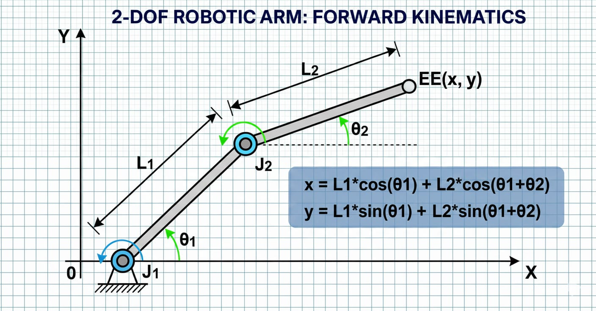

# Chapter 2: Fundamentals of Robotics (Kinematics & Dynamics)

## Learning Outcomes
Upon completing this chapter, you will be able to:
*   Differentiate between forward and inverse kinematics.
*   Understand the principles of robot dynamics and motion.
*   Apply various coordinate transformation techniques.
*   Analyze the forces and torques acting on robotic systems.

## Introduction
Robotics is a multidisciplinary field at the heart of Physical AI, focusing on the design, construction, operation, and application of robots. To understand how robots move and interact with their environment, a firm grasp of kinematics and dynamics is essential. Kinematics describes the motion of robots without considering the forces that cause it, while dynamics delves into the relationship between forces and motion. This chapter will introduce these fundamental concepts, providing the mathematical tools necessary to analyze and control robotic systems.

## Core Concepts

### Kinematics
Kinematics is the study of motion of points, bodies, and systems of bodies without considering the masses of those bodies or the forces that may have caused the motion. In robotics, kinematics is crucial for understanding how the joints and links of a robot move in space.

#### Forward Kinematics
Forward kinematics involves calculating the position and orientation of a robot's end-effector given the angles or displacements of its joints. This is typically done using transformation matrices or Denavit-Hartenberg (DH) parameters for robotic manipulators.

#### Inverse Kinematics
Inverse kinematics is the more challenging problem of determining the joint parameters (angles or displacements) required to achieve a desired position and orientation of the end-effector. This often involves solving non-linear equations and can have multiple solutions or no solutions at all.

### Dynamics
Robot dynamics deals with the relationship between the forces and torques acting on a robot and the resulting motion. It considers the mass, inertia, and external forces, providing insights into the energy and power requirements for robot operation.

#### Newton-Euler Formulation
The Newton-Euler formulation is a recursive method for deriving the equations of motion for a robot. It involves calculating the forces and moments acting on each link, starting from the base and moving outwards, and then propagating these values inwards.

#### Lagrangian Formulation
The Lagrangian formulation offers an alternative approach based on energy principles. It derives the equations of motion from the robot's kinetic and potential energy, often resulting in a more compact representation.

### Coordinate Transformations
Robotics heavily relies on various coordinate systems (world, base, joint, end-effector). Understanding how to transform between these systems using rotation matrices, translation vectors, and homogeneous transformation matrices is fundamental.

## Real-world Examples
*   **Robotic Arms in Manufacturing:** Precisely positioning welding torches or grippers using forward and inverse kinematics.
*   **Humanoid Robot Walking:** Dynamic balance and gait generation requiring complex dynamic models to prevent falls.
*   **Surgical Robots:** Manipulating instruments with high precision, where kinematics ensures accurate targeting of surgical sites.
*   **Space Robotics:** Operating robotic arms on space stations or rovers on planetary surfaces, where dynamics accounts for microgravity or varying gravitational forces.

## Diagrams

*Figure 2.1: Illustration of a 2-DOF robotic arm demonstrating forward kinematics.*

*Figure 2.2: Free-body diagram of a robot link for dynamic analysis.*

## Summary
Chapter 2 provided a foundational understanding of robotics through the lens of kinematics and dynamics. We differentiated between forward and inverse kinematics, explored methods for dynamic analysis like Newton-Euler and Lagrangian formulations, and highlighted the importance of coordinate transformations. These principles are indispensable for designing, controlling, and analyzing the motion of any robotic system, forming the bedrock upon which more advanced Physical AI concepts are built.
