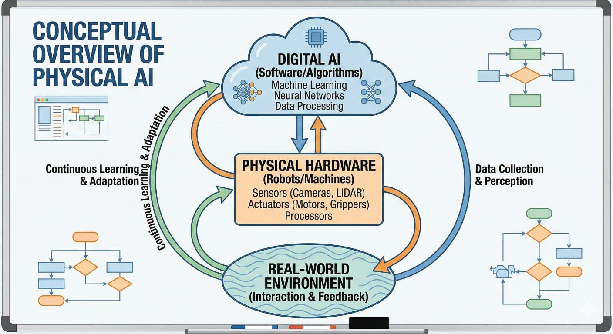
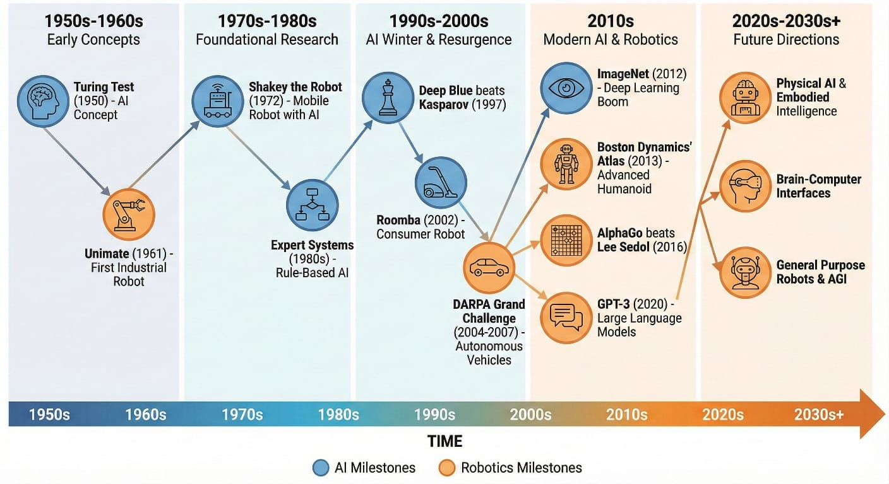

# Bölüm 1: Fiziksel Yapay Zekaya Giriş

## Öğrenme Çıktıları
Bu bölümü tamamladığınızda şunları yapabileceksiniz:
* Fiziksel Yapay Zekayı tanımlamak ve geleneksel Yapay Zekadan ayırmak.
* Robotik ve Yapay Zekanın tarihsel bağlamını ve evrimini anlamak.
* Fiziksel Yapay Zekada yer alan temel bileşenleri ve disiplinleri belirlemek.
* Akıllı fiziksel sistemlerin toplumsal etkisini ve etik hususlarını takdir etmek.

## Giriş
Fiziksel Yapay Zeka, yapay zekanın fiziksel dünya ile yakınsamasını temsil eder ve makinelerin gerçek dünya ortamlarında algılamasını, akıl yürütmesini, hareket etmesini ve öğrenmesini sağlar. Yalnızca dijital alanlarda çalışan Yapay Zekadan farklı olarak, Fiziksel Yapay Zeka robotları ve otonom sistemleri bedenler ve duyularla güçlendirerek çevreleriyle dinamik olarak etkileşime girmelerine olanak tanır. Bu giriş bölümü, bu heyecan verici alanı anlamak için zemin hazırlar, tanımlarını, tarihsel kökenlerini ve gelişiminin temelini oluşturan disiplinlerarası doğasını araştırır.

## Temel Kavramlar

### Fiziksel Yapay Zeka Nedir?
Fiziksel Yapay Zeka, gerçek dünyayı deneyimlemelerini ve manipüle etmelerini sağlayan fiziksel bir yapılanmaya sahip akıllı sistemleri ifade eder. Bu, Yapay Zeka algoritmalarını robotik donanım, sensörler ve aktüatörlerle entegre ederek yapılandırılmamış ortamlarda karmaşık görevleri yerine getirebilen otonom ajanlar oluşturmayı içerir. Temel özellikler arasında somut zeka, gerçek zamanlı etkileşim ve uyarlanabilir davranış bulunur.

### Tarihsel Evrim
Fiziksel Yapay Zekaya giden yolculuk, robotik, sibernetik ve yapay zeka ipliklerinden dokunmuş zengin bir dokudur. Tekrarlayan görevler için tasarlanmış ilk endüstriyel robotlardan günümüzün gelişmiş insansı robotlarına kadar, alan makinelerin başarabileceği şeylerin sınırlarını sürekli olarak zorlamıştır. Bu evrimi, Fiziksel Yapay Zekanın mevcut durumuna yol açan önemli kilometre taşlarını ve kavramsal atılımları vurgulayarak takip edeceğiz.

### Disiplinlerarası Temeller
Fiziksel Yapay Zeka, çok sayıda disiplinden büyük ölçüde yararlanır, bunlar arasında:
*   **Robotik:** Mekanik tasarım, kinematik, dinamik, kontrol teorisi.
*   **Yapay Zeka:** Makine öğrenimi, derin öğrenme, pekiştirmeli öğrenme, planlama.
*   **Bilgisayar Görüşü:** Nesne tanıma, sahne anlama, SLAM.
*   **Sensör Füzyonu:** Sağlam algı için çeşitli sensörlerden gelen verileri birleştirmek.
*   **İnsan-Bilgisayar Etkileşimi (HCI):** İnsanlar ve robotlar arasında sezgisel ve güvenli etkileşimler tasarlamak.

## Gerçek Dünya Örnekleri
Fiziksel Yapay Zeka artık fütüristik bir kavram değil, çeşitli sektörleri dönüştüren somut bir gerçektir:
*   **Otonom Araçlar:** Karmaşık ortamlarda gezinmek için kendi kendini süren arabalar ve dronlar.
*   **Endüstriyel Otomasyon:** Üretimde insanlarla birlikte çalışan işbirlikçi robotlar.
*   **Sağlık:** Cerrahi robotlar, protez uzuvlar ve yaşlılar için yardımcı robotlar.
*   **Keşif:** Mars'taki geziciler ve aşırı koşullarda veri toplayan su altı otonom araçlar.
*   **Lojistik:** Depo robotları malları verimli bir şekilde ayırma ve taşıma.

## Diyagramlar

*Şekil 1.1: Fiziksel Yapay Zeka bileşenlerinin kavramsal genel görünümü.*

*Şekil 1.2: Robotik ve Yapay Zekadaki önemli kilometre taşlarının zaman çizelgesi.*

## Özet
Bu bölüm, Fiziksel Yapay Zekayı Yapay Zekayı fiziksel yapılanma ile birleştiren disiplinlerarası bir alan olarak tanıttı ve gerçek dünya ile akıllı etkileşimi mümkün kıldı. Tanımını, tarihsel gelişimini ve kapsadığı çeşitli alanları tartıştık. Gerçek dünya örnekleri, sektörler üzerindeki yaygın etkisini gösterdi. Sonraki bölümler, Fiziksel Yapay Zekanın ve insansı robotların heyecan verici geleceğini anlamanız ve ona katkıda bulunmanız için size bilgi ve araçlar sağlayarak bu temel alanların her birine daha derinlemesine inecek.
